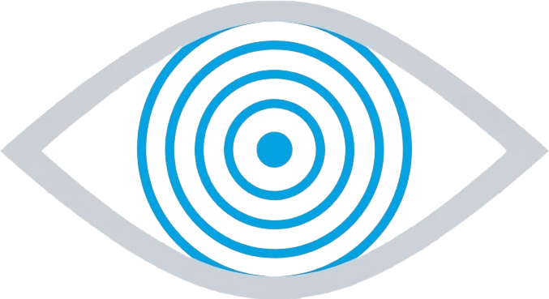

  
  
  # Oracus AI
  
  **Your AI-powered focus group. Test before you launch.**

  Simulate how your entire target market will react to any business decision — pricing changes, product launches, feature rollouts — before you spend a single dollar.

  ---

  🌐 [Live App](https://oracus-ai.vercel.app) · 🏆 Built for the [Amazon Nova AI Hackathon](https://amazon-nova.devpost.com/)

  **#AmazonNova**

---

## 🧠 The Problem

Every year, companies burn millions on product decisions that fail. Traditional market research — focus groups, A/B tests, consumer surveys — costs thousands of dollars and takes weeks to months. Most startups and small businesses skip it entirely and launch on gut instinct.

**The result?** Pricing that alienates core customers. Features nobody asked for. Pivots that come too late.

**The gap:** There is no fast, affordable way to predict how your target market will react to a decision *before* you make it.

## 💡 The Solution

Oracus AI fills this gap by simulating market response using generative AI. You describe your company, propose a change, and Oracus:

1. **Auto-detects** your company's products, pricing, audience, and competitors from public data
2. **Generates** 100 diverse AI personas modeled on real-world demographic distributions
3. **Simulates** each persona's individual reaction — with sentiment, reasoning, behavioral prediction, and willingness to pay
4. **Computes** 14 hard mathematical market indicators (NPS, churn risk, polarization, loyalty paradox, income-sentiment correlation, and more)
5. **Clusters** dominant market themes using K-Means on Amazon Titan Embeddings
6. **Validates** predictions against real-world market data via web search
7. **Generates** a profit-optimized strategic playbook with segment-specific advice
8. **Suggests** a revised strategy you can re-simulate with one click — creating an iterative loop that converges on the optimal decision

**Each full simulation: ~100 personas, ~2 minutes, under $0.10 on AWS.**

---

## 🚀 Live Application & Demo

- **Live Web App:** [https://oracus-ai.vercel.app](https://oracus-ai.vercel.app)

### Demo Video

  
   
  <em>Click to watch the full demo on YouTube</em>

---

## 🏗️ System Architecture

Oracus AI runs on **six specialized AI agents**, all powered by Amazon Nova 2 Lite via Amazon Bedrock:

| Agent | Role | Technology |
|-------|------|------------|
| **Population Architect** | Generates diverse persona archetypes from real-world demographics | Nova 2 Lite + Web Search |
| **Simulation Engine** | 100 parallel persona reactions with sentiment, behavior & WTP | Nova 2 Lite (parallel x100) |
| **Hard Math Analytics** | 14 deterministic metrics + K-Means clustering on embeddings | Python + sklearn + Amazon Titan Embeddings |
| **Diagnostic Report** | Executive-level factual assessment with segment risk classification | Nova 2 Lite |
| **Baseline Intelligence** | Real-world financial data via web search for delta comparison | Nova 2 Lite + Web Search |
| **Strategic Advisor** | Profit-optimized playbook with iterative re-simulation loop | Nova 2 Lite |

### Key Design Decisions

- **Hard math first, LLM interpretation second.** All 14 market indicators (NPS, churn, polarization, loyalty paradox, etc.) are computed deterministically in Python. The LLM never calculates percentages — it only interprets pre-computed metrics. This ensures mathematical accuracy and reproducibility.

- **K-Means clustering for theme discovery.** Instead of asking the LLM to categorize feedback (which would be subjective), we embed all persona reasoning strings via Amazon Titan Embeddings and run unsupervised K-Means clustering. The centroid-closest persona becomes the "representative voice" for each theme. Labels are applied cosmetically by the LLM afterward.

- **Archetype debiasing.** The Population Architect never sees the scenario being tested. It generates archetypes purely from company demographics, ensuring the simulated population isn't over-indexed on the change being tested. This prevents the "everyone has a strong opinion" bias that plagues naive LLM simulations.

- **Simulation debiasing.** The Simulation Engine explicitly permits personas to be indifferent. Without this, LLMs default to generating strong opinions for every persona — which is unrealistic. Real markets contain large neutral populations.

- **Baseline grounding.** The Strategic Advisor compares simulated outcomes against the company's real-world metrics (current churn, NPS, revenue) fetched via web search. This transforms raw simulation data into actionable deltas: "your churn would increase from 3% to 15%" is infinitely more useful than "15% churn risk."

---

## 🔬 Validation: Real-World Accuracy

We tested Oracus against **Netflix's 2023 password-sharing crackdown** — a well-documented real-world business decision with known outcomes.

**What Oracus predicted:**
- Majority of subscribers (solo household users) would be **indifferent** — neutral sentiment, zero churn
- Password-sharing households would react **strongly negative** with high churn intent
- The change would **not attract new customers** or win back lapsed users
- Revenue-weighted sentiment would remain **near-neutral** because the upset segments were lower-value

**What actually happened:**
- Netflix saw initial cancellation backlash concentrated in sharing households
- Solo subscribers were largely unaffected
- The company added 9.33 million net new subscribers as freeloaders converted to paid accounts
- Revenue increased despite the vocal backlash

Oracus correctly identified the polarized reaction structure and the fact that the financially important segments would be unaffected — the core insight that justified Netflix's decision to proceed.

---

## 🛠️ Technology Stack

| Layer | Technology |
|-------|-----------|
| **Frontend** | React 19 + TypeScript + Vite + Tailwind CSS |
| **State Management** | Zustand |
| **Charts** | Recharts |
| **Backend** | Python + FastAPI |
| **AI Models** | Amazon Nova 2 Lite (via Amazon Bedrock Converse API) |
| **Embeddings** | Amazon Titan Embed Text v2 |
| **Web Search** | Nova 2 Lite with nova_grounding system tool |
| **Clustering** | scikit-learn K-Means |
| **Data Processing** | Pandas + NumPy |
| **Deployment** | Vercel (frontend + backend) |

---

## 🎯 Why Amazon Nova?

Nova 2 Lite's **price-performance ratio** is what makes Oracus feasible. Each simulation run involves 100+ parallel LLM calls (one per persona) plus analysis, diagnostics, baseline intelligence, and strategic advice. With more expensive models, a single run could cost dollars. With Nova 2 Lite, the entire pipeline runs for under 10 cents — making the iterative "simulate → suggest → re-simulate" loop practical and affordable.

The **web search grounding** via `nova_grounding` is critical for two agents: the Company Profile Builder (auto-detecting company data from public sources) and the Baseline Intelligence agent (fetching real-world financial metrics for delta comparison). This grounding is what separates Oracus from pure LLM speculation.

**Amazon Titan Embeddings** power the K-Means clustering that identifies dominant market themes — keeping the entire analytical pipeline within the AWS ecosystem.

---

## 🗺️ Future Roadmap

- **Historical simulation tracking** — Compare how predictions evolve across multiple runs
- **Real analytics integration** — Validate Oracus predictions against actual post-launch data
- **Custom persona templates** — Industry-specific archetype libraries for faster setup
- **Export reports as PDF** — Shareable executive summaries for stakeholder presentations
- **Competitive scenario testing** — Simulate how competitors' customers would react to YOUR moves
- **Multi-scenario comparison** — Test 3+ variants side-by-side against the same persona population

---

  **Oracus AI** — Test before you launch.

  Built with ❤️ using Amazon Nova on AWS Bedrock

  **#AmazonNova**

